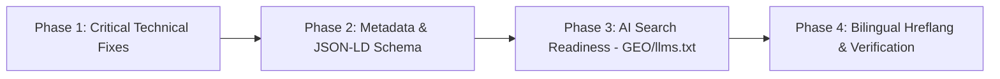

# SEO & GEO Implementation Action Plan

**Target Platform:** TelegramGeeks Pro (`https://telegramgeeks.pro`)  
**Implementation Priority:** Ranked by Impact vs. Effort  
**Date:** August 21, 2026

---

## 1. Execution Roadmap

---

## 2. Prioritized Action Items

### Phase 1: Critical Technical Fixes (Immediate)

- [x] **Task 1.1: Create Dynamic `robots.ts`**
  - **File:** `frontend/src/app/robots.ts`
  - **Impact:** High | **Effort:** Low (10 mins)
  - **Details:** Allow Googlebot, Bingbot, and AI bots (`GPTBot`, `ClaudeBot`, `PerplexityBot`) on public content. Disallow `/dashboard/*`, `/admin/*`, `/api/*`, `/login`, `/register`. Link sitemap index.

- [x] **Task 1.2: Create Dynamic `sitemap.ts`**
  - **File:** `frontend/src/app/sitemap.ts`
  - **Impact:** High | **Effort:** Low (15 mins)
  - **Details:** Automatically index all marketing pages (`/`, `/about`, `/contacts`, `/manuals`, `/reviews`, `/partner`), bilingual routes (`/cn/*`), and all 10 blog post articles with fresh `lastModified` dates and priority weighting.

---

### Phase 2: Metadata & Structured Data (High Impact)

- [x] **Task 2.1: Expand Global Metadata in `RootLayout`**
  - **File:** `frontend/src/app/layout.tsx`
  - **Impact:** High | **Effort:** Low (10 mins)
  - **Details:** Add `metadataBase`, Open Graph title/description/image, Twitter card `summary_large_image`, keywords, robots indexing directives, and language alternates.

- [x] **Task 2.2: Add JSON-LD Structured Data to Homepage**
  - **File:** `frontend/src/app/page.tsx`
  - **Impact:** High | **Effort:** Low (15 mins)
  - **Details:** Add `SoftwareApplication`, `Organization`, and `WebSite` JSON-LD schema so Google displays rich snippets, software category rating, and site search box.

- [x] **Task 2.3: Add Article JSON-LD Schema to Blog Template**
  - **File:** `frontend/src/app/blog/[slug]/page.tsx`
  - **Impact:** Medium-High | **Effort:** Low (15 mins)
  - **Details:** Include `BlogPosting` / `Article` schema with headline, author, datePublished, dateModified, publisher, and mainEntityOfPage.

---

### Phase 3: AI Search Optimization (GEO / AEO)

- [x] **Task 3.1: Create `llms.txt` and `llms-full.txt`**
  - **File:** `frontend/public/llms.txt` & `frontend/public/llms-full.txt`
  - **Impact:** High (Emerging AI Overviews) | **Effort:** Low (15 mins)
  - **Details:** Markdown-formatted summary for LLM scrapers (Perplexity, ChatGPT Search, Claude, Gemini) indexing all 77 modules, technical architecture, and pricing.

---

### Phase 4: Verification & Monitoring

- [ ] **Task 4.1: Submit Sitemap to Google Search Console & Bing Webmaster Tools**
  - URL: `https://telegramgeeks.pro/sitemap.xml`
- [ ] **Task 4.2: Test Rich Results in Google Rich Results Test Tool**
  - Verify `SoftwareApplication` and `Article` schema validation with 0 errors.
